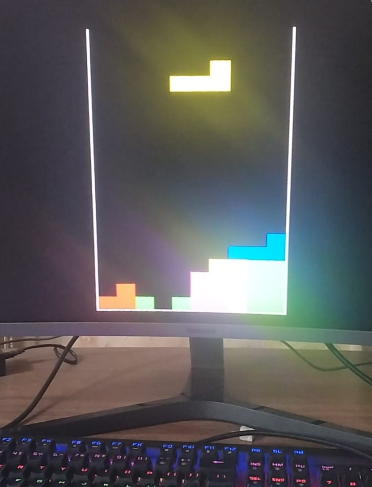

#  Tetris Arcade Game on FPGA

**A complete, hardware-level implementation of the classic Tetris arcade game written in Verilog HDL and deployed on the Xilinx Nexys A7-100T FPGA.**

This project demonstrates the transition from sequential software logic to parallel hardware design, featuring custom 60Hz VGA rendering, Block RAM (BRAM) memory management, and combinational look-ahead collision detection.

##  Key Technical Features

* **Hardware VGA Controller:** Custom-built 60Hz render pipeline translating physical electron-beam coordinates (`h_count`, `v_count`) into a 10x20 active game grid using integer division and priority multiplexing.
* **Block RAM (BRAM) Integration:** Architected a 2D memory array mapped to the FPGA's physical silicon to persistently track locked blocks and game states.
* **Look-Ahead Collision Radar:** Utilized pure combinational logic and ternary boundary guards to calculate hypothetical future coordinates, preventing invalid rotations, wall-clipping, and memory-address underflows.
* **LFSR Pseudo-Random Number Generator:** Engineered an 8-bit Linear Feedback Shift Register using XOR logic gates to tap high-frequency hardware counters for pseudo-random piece shape and color generation.
* **Robust Input Debouncing:** Implemented digital sampling counters to filter mechanical switch bounce, coupled with edge-detection registers for precise, single-cycle block movement and hard drops.
* **Finite State Machine (FSM):** Asynchronous state management handling gravity timers, synchronous line-clearing array shifts, and game-over conditions.

##  Hardware Requirements

* **Board:** Xilinx Nexys A7-100T (or equivalent Artix-7 FPGA)
* **Display:** Standard VGA Monitor (640x480 resolution @ 60Hz)
* **Input:** On-board mechanical push buttons

##  Project Architecture

The project strictly follows a modular hardware design pattern, separating the top-level wiring from the core game logic.

* `tetris.v` **(Top Module):** Acts as the "Motherboard." Handles physical pin assignments, instantiates the game logic, and utilizes a logic counter to divide the board's native 100 MHz clock down to the 25 MHz pixel clock required by the VGA standard.
* `vga_controller.v` **(Game Core):** Acts as the "Graphics Card." Contains the BRAM array, physics engine, PRNG, collision radar, and the VGA signal timing logic.
* `constraints.xdc`: Maps the Verilog variables to the physical copper pins on the Nexys A7 board (VGA outputs, clock, buttons).

##  Game Controls

| Button | Action | Description |
| :--- | :--- | :--- |
| **BTNL** | Move Left | Shifts the active piece left. Protected by boundary/memory radar. |
| **BTNR** | Move Right | Shifts the active piece right. Protected by boundary/memory radar. |
| **BTNU** | Rotate | Rotates the piece 90 degrees clockwise. |
| **BTND** | Soft Drop | Accelerates the downward gravity of the active piece. |
| **CPU_RESET** | Restart | Wipes the BRAM to zeroes and resets the FSM to the initial state. |

---
**Author:** Abdullah Alom  
*B.Tech in Electrical and Electronics Engineering, IIT Guwahati*